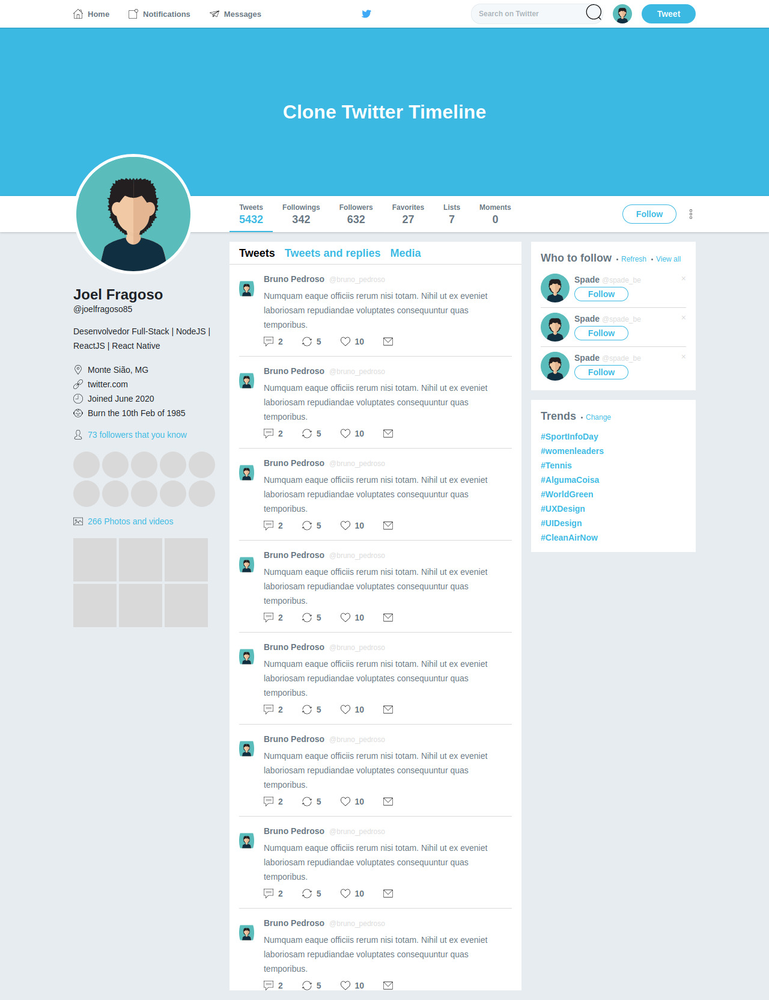

    

<h3 align="center">CSS3 Flexbox</h3>

  

  

  

  <a href="#projeto">Projeto</a>&nbsp;&nbsp;|&nbsp;&nbsp;
  <a href="#licença">Licença</a>

## Projeto

Clone da timeline do Twitter desenvolvido com os conceitos de flexbox layout aplicado no bonus do Bootcamp GoStack 12.

    

## Licença

Este projeto está sobre a licença do MIT.
Clique aqui [LICENSE](https://github.com/joel-fragoso/conceitos-flexbox/blob/master/LICENSE) para mais informações.

Feito com ❤️ por Joel Fragoso 👋 [LinkedIn!](https://www.linkedin.com/in/joel-fragoso-0906611a9/).
